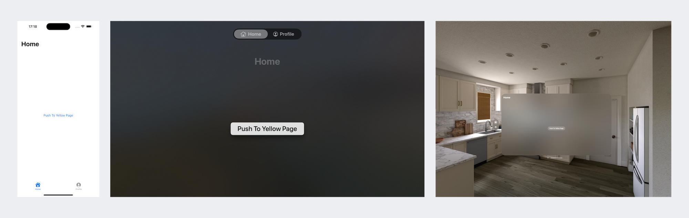

# Arc



Here's an example of a deep link app for Apple platforms, including iOS, tvOS, and watchOS, with macOS currently under development.

With this architecture, you don't need to worry about the organizational structure of navigation components. All you need to do is register a page and develop it, without having to concern yourself with the details of how the navigation is organized.

```Swift
let url = URL.init(string: "arc://hong.com/aboutpage")!
ArcApp.open(url: url)
```
