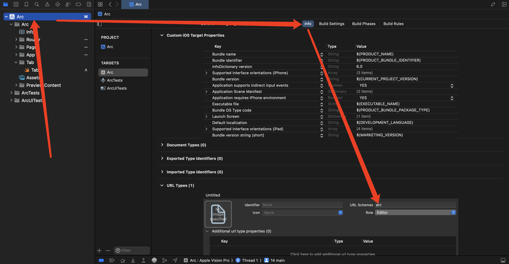

# SwiftUI如何使用DeepLink技术


## 1、什么是DeepLink

就是下面这种短链

1、短信

```
SMS://
```

2、电话

```
tel://
```

3、微信扫一扫

```
weixin://dl/scan
```

点击这个链接就可以在App内直达一个页面。

支持DeepLink的App好处多多，我最喜欢的一个好处就是可以在页面间，甚至是窗口间、场景间解除耦合。

但是在SwiftUI开发环境下，如何支持呢？

Well goes an old saying

>“如果你不知道怎么做客户端架构，那你就去看看前端怎么做，毕竟他们每年可以设计好几百种框架，总有一款适合你。”


开发之初通过[Vue的官方Router](https://cn.vuejs.org/guide/scaling-up/routing.html) 仔细理解了下路由的概念。明确了开发目标：我们要做的就是一个标识符对应一个页面级的View。


## 2、App是如何导航的

在屏幕较小的设备我们通常使用tab空间来区分不同的模块，使用导航来进入到该模块更深的层级，在较大屏幕的设备上一般使用侧边栏来区分不同的模块，同样使用导航来进入到该模块更深的层级。


## 3、实操
### 3.1 模块内的Navigation导航

在导航方面，我们想要的是一个标识符对应一个页面，最终我找到了navigationstack来胜任这个工作。

<https://developer.apple.com/documentation/swiftui/navigationstack>

```swift
NavigationStack {
    List(parks) { park in
        NavigationLink(park.name, value: park)
    }
    .navigationDestination(for: Park.self) { park in
        ParkDetails(park: park)
    }
}
```

我们创建一个ViewModel，创建一个homeNavStack变量来维护这个导航的深度信息

```swift
import SwiftUI

// ViewModel for App
class AppData: ObservableObject {

    /// Home NavigationStatck
    @Published var homeNavStack: [String] = []
}
```

如果想回到导航的Root页面话，可以直接设置homeNavStack=[]

### 3.2 模块之间的导航

现在以iOS的tab为例

1、创建一个Tab的枚举

```swift
import SwiftUI

public enum Tab:String, CaseIterable {
    
    case home = "0"
    case profile = "1"
    
    @ViewBuilder
    var label: some View {
        switch self {
        case .home:
            Label("Home", systemImage: "house")
        case .profile:
            Label("Profile", systemImage: "person.crop.circle")
        }
    }
    
    static func convert(from:String) -> Self?{
        return Tab.allCases.first{ tab in
            tab.rawValue.lowercased() == from.lowercased()
        }
    }
}
```

2、在AppData中新增一个变量维护当前选中的tab，默认选中home

```swift
import SwiftUI

// ViewModel for App
class AppData: ObservableObject {
    @Published var activeTab: Tab = .home
    /// Home NavigationStatck
    @Published var homeNavStack: [String] = []
}
```

3、创建一个Router

```Swift
protocol DeepLink {
    var pageParams: [String: String]? { get set }
}

struct Router {
    
    static func NavDestinationForWith(_ page: String)-> AnyView{
    
        var view:any View;
        switch page {
        case "purplepage":
            view = PurlplePage()
        case "yellowpage":
            view = YellowPage()
        case "aboutpage":
            view = AboutPage()
            
        default:
            view = EmptyView()
        }
        
        if var deepLinkView = view as? any DeepLink & View{
            deepLinkView.pageParams = ["name":"huanghong"]
            return AnyView(deepLinkView)
        }else{
            return AnyView(view)
        }
    }
}
```

4、创建页面结构

```swift
let scheme = "arc"     // protocol
let host = "hong.com"  // host

struct ContentView: View {
    
    @EnvironmentObject private var appData:AppData

    var body: some View {
        TabView(selection: $appData.activeTab,
                content:  {
            HomeView()
                .tag(Tab.home)
                .tabItem {
                    Tab.home.label
                }
            ProfileView()
                .tag(Tab.profile)
                .tabItem {
                    Tab.profile.label
                }
        })
        .onOpenURL(perform:onOpenURL)
    }
    
    @ViewBuilder
    func HomeView() -> some View{
        NavigationStack(path: $appData.homeNavStack){
            HomePage()
                .navigationTitle("Home")
                .navigationDestination(for: String.self) { page in
                    Router.NavDestinationForWith(page)
                        .environmentObject(appData)
                }
        }
    }
    
    @ViewBuilder
    func ProfileView() -> some View{
        NavigationStack(path: $appData.profileNavStack){
            ProfilePage()
                .navigationTitle("Profile")
                .navigationDestination(for: String.self) { page in
                    Router.NavDestinationForWith(page)
                }
        }
    }
    
    /// 应用内打开链接
    func onOpenURL(url:URL){
        
        if (scheme != url.scheme){
            return;
        }
        
        if (host != url.host()){
            return;
        }
        
        // 解析page
        let pathComponents = url.pathComponents
        guard let page = pathComponents.last else{
            return
        }
        
        // 解析params
        let params = pageParams(url)
        
        // Tab页面
        if page.lowercased() == "tab" {
            guard let params = params, let tabIndex = params["tabIndex"] ,let tabRawValue = Tab.convert(from: tabIndex) else {
                return
            }
            appData.activeTab = tabRawValue
            return
        }
        
        // 正常页面导航
        switch appData.activeTab {
        case .home:
            appData.homeNavStack.append(page)
        case .profile:
            appData.profileNavStack.append(page)
        }
    }
    
    /// 获取页面的参数
    func pageParams(_ url: URL) -> Dictionary<String, String>? {
        let components = URLComponents(url: url, resolvingAgainstBaseURL: true)
        guard let queryItems = components?.queryItems else{
            return nil
        }
        var paramMap = [String: String]()
        for item in queryItems {
            if let value = item.value {
                paramMap[item.name] = value
            }
        }
        return paramMap
    }
    
}
```

## 4、打开任意页面

1、在工程中配置scheme



2、打开任意页面
```swift
let url = URL.init(string: "arc://hong.com/aboutpage")!
UIApplication.shared.open(url)
```
